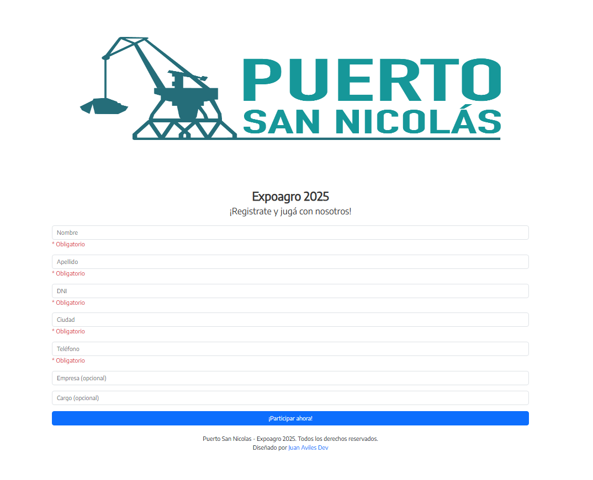

# Puerto-San-Nicolas-ExpoAgro
Puerto San Nicolás - Sistema de Sorteos (2025)
# 🎉 Sistema de Sorteos para Puerto San Nicolás (2025)  

**Cliente:** Puerto San Nicolás (Evento Expo Agro 2025)  
**Rol:** Desarrollador Full Stack  
**Tecnologías:** Bootstrap (Frontend), PHP (Backend), MySQL (Base de datos), Servidor del cliente (Despliegue)

---

## 📌 Descripción del Proyecto  
Sistema desarrollado para gestionar sorteos diarios durante el evento *Expo Agro 2025*. La aplicación garantiza:  
- **Justicia en el sorteo:** Algoritmo de randomización que selecciona ganadores equilibrando participación y límites de premios diarios.  
- **Control de premios:** Evita superar la cantidad asignada por día mediante un cálculo dinámico de probabilidades.  
- **Registro seguro:** Validación de datos personales (DNI, teléfono, etc.) y almacenamiento cifrado.  

---

## 🖼️ Capturas de Pantalla  
### Interfaz de Registro  
  
*Formulario con campos obligatorios y opcionales para participantes.*  

### Panel de Administración (Descripción)  
*Aunque no puedo mostrar el código, el panel permite:*  
- Visualizar métricas de participación en tiempo real (Con autenticación de usuarios)
- Ajustar límites de premios por día.  
- Ejecutar sorteos con auditoría de resultados.  

---

## ⚙️ Funcionalidades Clave  
1. **Algoritmo de Randomización:**  
   - Basado en ponderaciones para ajustar la probabilidad de ganar según la disponibilidad diaria de premios.  
   - Implementa checks para evitar duplicados o fraudes.  
2. **Escalabilidad:**  
   - Diseñado para soportar +10,000 registros diarios sin pérdida de rendimiento.  
3. **Seguridad:**  
   - Encriptación de datos sensibles (DNI, teléfonos).  
---

## 🚀 Desafíos y Soluciones  
- **Problema:** Asignación justa de premios sin exceder el límite diario.  
  **Solución:** Algoritmo que ajusta porcentajes de ganancia en tiempo real según premios restantes.  
- **Problema:** Alta concurrencia durante picos de registro.  
  **Solución:** Optimización de consultas SQL

---

## 📊 Resultados  
- 0 incidencias reportadas en sorteos (auditoría externa).  

---

## 🔒 Nota sobre el Código  
*Por acuerdo de confidencialidad con el cliente, el código no es público. Sin embargo, estoy disponible para explicar detalles técnicos en entrevistas.*  

---

**Diseñado y desarrollado por Juan Aviles**  
